# Test assignment

---

## Service for track items in every warehouse

### For start the service use `docker-compose up`
### When server start use `make m-up` for up migrations
### Now you can use service
### Request examples from client in `internal/app/client/client.go`

## API Description

* ### UploadProduct
    *  **input data:** `name, size, code, quantity, warehouseId`
    *  **output:** `responseMsg`

  ### request: 
  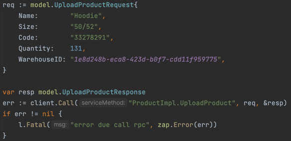
  ### response: `{success}`
  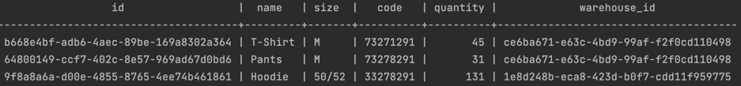

* ### UpdateProduct
  *  **input data:** `name, size, code, quantity, warehouseId`
  *  ***output:*** `reponseMsg` 

  ### request:
  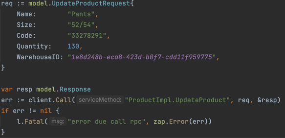
  ### response: `{success}`
  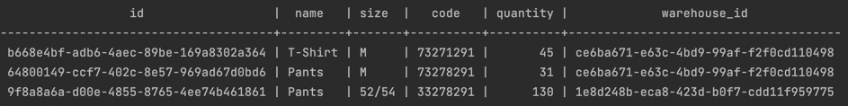

* ### GetProduct
  *  **input data:** `productCode, warehouseId`
  *  **output:** `product info` 
  
  ### request:
  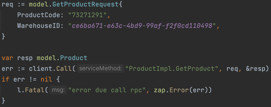
  ### response: `{b668e4bf-adb6-4aec-89be-169a8302a364 T-Shirt M 73271291 45 ce6ba671-e63c-4bd9-99af-f2f0cd110498}`

* ### ListProduct
  *  **input data:** `warehouseId`
  *  **output:** `[]product info`

  ### request:
  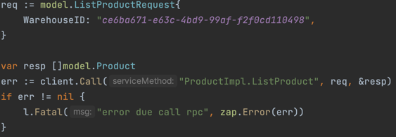
  ### response: `[{b668e4bf-adb6-4aec-89be-169a8302a364 T-Shirt M 73271291 45 ce6ba671-e63c-4bd9-99af-f2f0cd110498} {64800149-ccf7-402c-8e57-969ad67d0bd6 Pants M 73278291 31 ce6ba671-e63c-4bd9-99af-f2f0cd110498}]`

* ### DeleteProduct
  *  **input data:** `productCode, warehouseId`
  *  **output:** `responseMsg`
  
  ### request:
  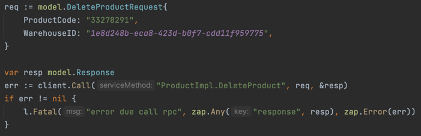
  ### response: `{success}`
  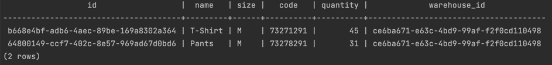

* ### ReserveProduct
  *  **input data:** `[]productCode, warehouseId, quantity`
  *  **output:** `responseMsg`
  
  ### request:
  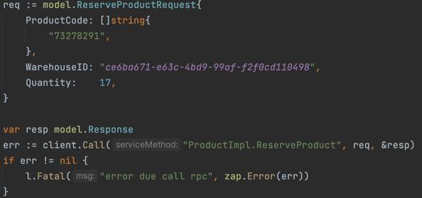
  ### response: `{success}`
  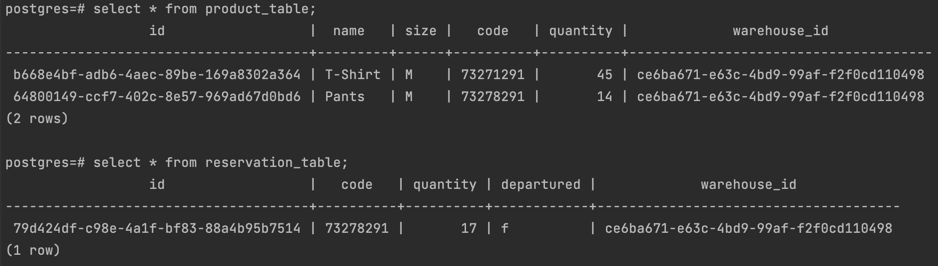
  

* ### ReleaseReserve
  *  **input data:** `[]productCode, warehouseId`
  *  **output:** `responseMsg`

  ### request:
  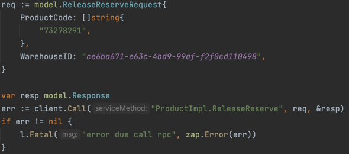
  ### response: `{success}`
  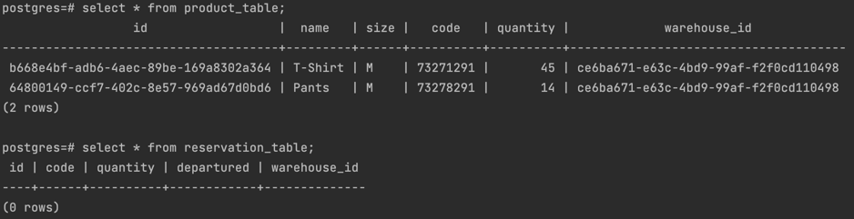
